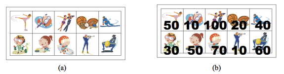
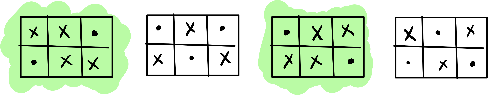
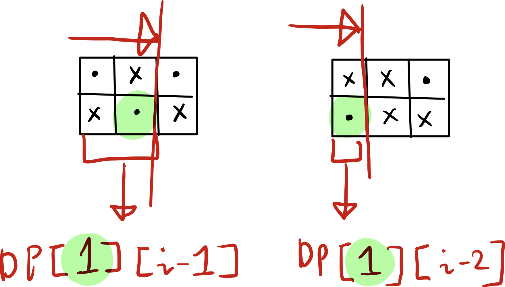
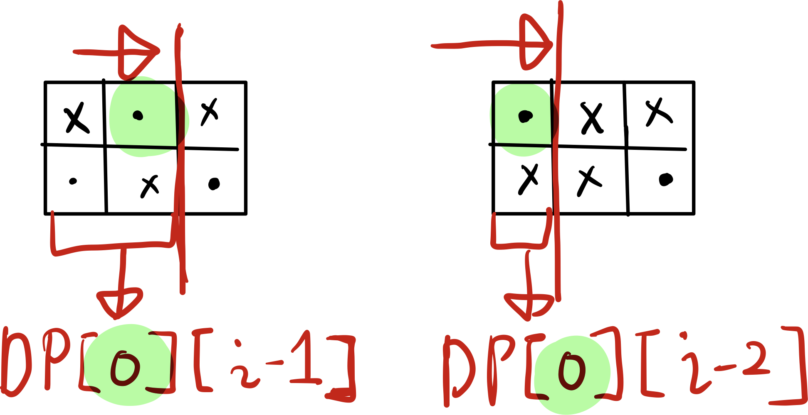

## 문제

상근이의 여동생 상냥이는 문방구에서 스티커 2n개를 구매했다. 스티커는 그림 (a)와 같이 2행 n열로 배치되어 있다. 상냥이는 스티커를 이용해 책상을 꾸미려고 한다.

상냥이가 구매한 스티커의 품질은 매우 좋지 않다. 스티커 한 장을 떼면, 그 스티커와 변을 공유하는 스티커는 모두 찢어져서 사용할 수 없게 된다. 즉, 뗀 스티커의 왼쪽, 오른쪽, 위, 아래에 있는 스티커는 사용할 수 없게 된다.



모든 스티커를 붙일 수 없게된 상냥이는 각 스티커에 점수를 매기고, 점수의 합이 최대가 되게 스티커를 떼어내려고 한다. 먼저, 그림 (b)와 같이 각 스티커에 점수를 매겼다. 상냥이가 뗄 수 있는 스티커의 점수의 최댓값을 구하는 프로그램을 작성하시오. 즉, 2n개의 스티커 중에서 점수의 합이 최대가 되면서 서로 변을 공유 하지 않는 스티커 집합을 구해야 한다.

위의 그림의 경우에 점수가 50, 50, 100, 60인 스티커를 고르면, 점수는 260이 되고 이 것이 최대 점수이다. 가장 높은 점수를 가지는 두 스티커 (100과 70)은 변을 공유하기 때문에, 동시에 뗄 수 없다.

## 입력

첫째 줄에 테스트 케이스의 개수 T가 주어진다. 각 테스트 케이스의 첫째 줄에는 n (1 ≤ n ≤ 100,000)이 주어진다. 다음 두 줄에는 n개의 정수가 주어지며, 각 정수는 그 위치에 해당하는 스티커의 점수이다. 연속하는 두 정수 사이에는 빈 칸이 하나 있다. 점수는 0보다 크거나 같고, 100보다 작거나 같은 정수이다.

## 출력

각 테스트 케이스 마다, 2n개의 스티커 중에서 두 변을 공유하지 않는 스티커 점수의 최댓값을 출력한다.

---

## 풀이

문제를 천천히 뜯어봅시다. 일단 스티커를 고를 때 점수의 합이 최대가 되려면 어떻게 해야 할까요? 요리조리 분석해 보면, 어떤 방식으로 스티커를 뜯어도 마지막 열 중 하나는 반드시 골라야 함을 알 수 있습니다. 왜냐구요?

그 전의 열까지 어떻게 스티커를 골라도 마지막 열 중에 하나를 고르지 않으면 무조건 손해니까요! 두 행 전부 스티커가 뜯어지는 일은 결코 없답니다!

저는 이 문제를 어떻게 쪼개고 답을 구할 지 생각해 보았는데 경우의 수를 곰곰이 따져 보니 한 열에는 무조건 스티커를 **하나 이하**로만 고를 수 있었습니다.

그래서 처음에는

```
DP[N] = (N열 까지 스티커를 골랐을 때 최대로 고를 수 있는 스티커 가치의 합)
```

이라고 점화식을 잡았습니다. 그렇지만 이렇게 세우면 경우의 수를 제대로 따질 수 없었습니다.


위 그림에서, 점(.)은 내가 고른 스티커입니다. 여기까지는 괜찮은 것 같습니다.

`N = 3` 이 되면 다음과 같은 경우의 수가 생깁니다.



여기서 형광펜으로 칠한 부분은 단순히 바로 전의 DP 값에 (`DP[n-1]`) 두 열 중 하나를 고르면 안 됩니다. → `DP[n-2] + (둘 행의 값 중에 최댓값)`으로 골라야 합니다. 왜냐하면 `DP[n-1]`의 값은 마지막 열에서 어떤 것이든 스티커를 골랐을 테니까 이번 경우와는 맞지 않습니다.

그리고 형광펜으로 칠하지 않은 부분도 전에 (`DP[n-1]` 에서, 마지막 열에서, 어떤 스티커를 골랐는지) 고른 부분을 알아야 합니다. 그걸 모르면 어떤 스티커를 선택해야 할 지 알 수 없습니다. 따라서 위에 나온 점화식으로는 뭔가 부족합니다.

따라서 저는 점화식을 다음과 같이 개선하였습니다.

```
DP[h][N] = (현재 h행의 스티커를 골랐을 때, N열 까지 스티커를 골랐을 때, 최대로 고를 수 있는 스티커 가치의 합)
```

행 정보를 추가함으로써, 이전에 어떤 스티커를 골랐는 지 알 수 있습니다.

정답은 `max(DP[0][n-1], DP[1][n-1])` 이 될 것입니다. (배열의 인덱스가 0부터 시작할 경우)

초기 경우(스티커가 한 열일 때)는 다음과 같이 구합니다.

`dp[0][0] = stickers_score[0][0]; // 0행을 골랐을 때 0행의 스티커 가치`
`dp[1][0] = stickers_score[1][0]; // 1행을 골랐을 때 1행의 스티커 가치`

다음 열이 추가되었을 때, 다음과 같이 구할 수 있습니다.

`dp[0][1] = stickers_score[0][1] + dp[1][0];`

위의 식에서 좌변은 이번에 0행의 스티커를 고르기로 했을 때, 1열까지 스티커를 골랐을 때, 최대로 고를 수 있는 스티커 가치입니다. 따라서 현재 열 (1열)의 스티커 가치에다가 이전의 대각선에 있는 스티커의 값을 더해줍니다. 그 외의 경우는 없습니다.
`dp[1][1] = stickers_score[1][1] + dp[0][0];`

위의 식도 마찬가지로 계산합니다.

이제 점화식을 세워 봅니다. 여기서 `i` 는 현재의 열입니다. 이것을 반복하여 구하고자 하는 `n-1` 열까지 반복하면 되겠습니다. :D



`dp[0][i] = max(stickers_score[0][i] + dp[1][i-1], stickers_score[0][i] + dp[1][i-2]);`



`dp[1][i] = max(stickers_score[1][i] + dp[0][i-1] , stickers_score[1][i] + dp[0][i-2]);`

## 소스 코드

```cpp
#include <vector>
#include <iostream>
#include <algorithm>

using namespace std;

int tc;
int dp[2][100000] = {-1};
int stickers_score[2][100000];

int main()
{
  cin >> tc;
  while (tc--) {
    int n;
    cin >> n;
    for (int i = 0; i < 2; i++) {
      for (int j = 0; j < n; j++) {
        cin >> stickers_score[i][j];
      }
    }
    dp[0][0] = stickers_score[0][0];
    dp[1][0] = stickers_score[1][0];
    if (n == 1) {
      cout << max(dp[0][0], dp[1][0]) << endl;
      return 0;
    }

    dp[0][1] = stickers_score[0][1] + dp[1][0];
    dp[1][1] = stickers_score[1][1] + dp[0][0];
    if (n == 2) {
      cout << max(dp[0][1], dp[1][1]) << endl;
      return 0;
    }
    for (int i = 2; i < n; i++) {
      dp[0][i] =  max(stickers_score[0][i] + dp[1][i-1], stickers_score[0][i] + dp[1][i-2]); // 마지막 : 고도 0
      dp[1][i] =  max(stickers_score[1][i] + dp[0][i-1] , stickers_score[1][i] + dp[0][i-2]); // 마지막 : 고도 1
    }
    cout << max(dp[0][n-1], dp[1][n-1]) << endl;
  }
  return 0;
}
```
