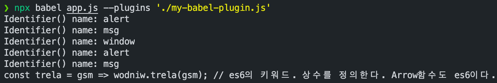

# 배경

## 크로스 브라우징

사용하는 말이 달라서 바벨탑이 실패했듯이, 브라우저마다 사용하는 언어가 달라서 프론트엔드 코드는 일관적이지 못할 때가 많다. 크로스브라우징의 혼란을 해결해 줄 수 있는 것이 바벨이다. ECMAScript2015+로 작성한 코드를 모든 브라우저에서 동작하도록 호환성을 지켜준다. Typescript, JSX처럼 다른 언어로 분류되는 것도 포함한다.

## 트랜스파일과 빌드

이렇게 변환하는 것을 트랜스파일한다고 표현한다. 변환 전후의 추상화 수준이 다른 빌드와는 달리 트랜스파일은 추상화 수준을 유지한 상태로 코드를 변환한다. 타입스크립트 → 자바스크립트, JSX → 자바스크립트처럼 트랜스파일 후에도 여전히 코드를 읽을 수 있다.

# 바벨의 기본 동작

`npm install -D @babel/core @babel/cli`

`npx babel app.js`

⇒ const alert = msg ⇒ window.alert(msg); // 그대로 나옴

- 바벨은 세 단계로 빌드를 진행한다.
  1. 파싱 (Parsing)
  2. 변환 (Transforming)
  3. 출력 (Printing)
- 기본적으로 바벨은 코드를 받아서 코드를 반환한다. 바벨 함수를 정의한다면 이런 모습이 될 것이다.

```jsx
[const babel = code => code;](https://babeljs.io/docs/en/plugins) // https://babeljs.io/docs/en/plugins
```

- 바벨은 파싱과 출력만 담당하고 변환 작업은 다른 모듈이 처리하는데 이것을 "플러그인"이라고 한다.

## 커스텀 플러그인

```jsx
module.exports = function myBabelPlugin() {
  return {
    visitor: {
      // path라는 객체를 받게 되어 있다.
      Identifier(path) {
        const name = path.node.name

        // 바벨이 만든 AST 노드를 출력한다.
        console.log("Identifier() name:", name)
        // 변환작업: 코드 문자열을 역순으로 변환한다.
        path.node.name = name
          .split("")
          .reverse()
          .join("")
      },
    },
  }
}
```



이제 const → var로 바꿔 보자.

```jsx
module.exports = function myBabelPlugin() {
  return {
    visitor: {
      // const나 var, let 등을 캡쳐해 온다.
      VariableDeclaration(path) {
        console.log("VariableDeclaration() kind: ", path.node.kind) // const

        if (path.node.kind === "const") {
          path.node.kind = "var"
        }
      },
    },
  }
}
```


## 플러그인 사용하기

이러한 결과를 만드는 것이 block-scoping 플러그인이다. const, let처럼 블록 스코핑을 따르는 예약어를 함수 스코핑을 사용하는 var로 변경한다.

```bash
npm install @babel/plugin-transform-block-scoping
```

이제 화살표 함수를 변환하자.

```bash
npm install @babel/plugin-transform-arrow-functions
```

ECMAScript5에서부터 지원하는 엄격 모드를 사용하는 것이 안전하기 때문에 "use strict" 구문을 추가해야겠다. **strict-mode** 플러그인을 사용하자.

그전에 커맨드라인이 길어진다. babel.config.js를 작성하자.

```jsx
module.exports = {
  plugins: [
    "@babel/plugin-transform-block-scoping",
    "@babel/plugin-transform-arrow-functions",
    "@babel/plugin-transform-strict-mode",
  ],
}
```

이후 `npx babel app.js` 로 실행해 보면 결과가 나온다.

그런데...

# 프리셋

ECMAScript2015+으로 코딩할 때 필요한 플러그인을 일일이 설정하는 일은 무척 지난한 일이다. 코드 한 줄 작성하는데도 세 개 플러그인 세팅을 했으니 말이다. 목적에 맞게 여러 가지 플러그인을 세트로 모아놓은 것을 "프리셋"이라고 한다.

## 커스텀 프리셋

사용한 세 개 플러그인을 하나의 프리셋으로 만들어 보겠다. my-babel-preset.js 파일을 다음과 같이 작성하자.

```jsx
// my-babel-preset.js
module.exports = function myBabelPreset() {
  return {
    plugins: [
      "@babel/plugin-transform-block-scoping",
      "@babel/plugin-transform-arrow-functions",
      "@babel/plugin-transform-strict-mode",
    ],
  }
}
```

```jsx
// babel.config.js
module.exports = {
  presets: ["./my-babel-preset.js"],
}
```

`npx babel app.js` 를 해 보면 이전과 동일하게 잘 변환된 것을 볼 수 있다.

## 프리셋 사용하기

이처럼 바벨은 목적에 따라 몇 가지 프리셋을 제공한다.

- preset-env
  - ECMAScript2015+를 변환할 때 사용한다. 바벨 7 이전 버전에는 연도별로 각 프리셋을 제공했지만 지금은 env 하나로 합쳐졌다. 무척 맘에 든다 >\_<
- preset-flow
- preset-react
- preset-typescript

나머지 세 가지는 flow, 리액트, 타입스크립트를 변환하기 위한 프리셋이다.

IE 지원을 위한 env 프리셋을 사용해 보자. 먼저 패키지를 다운로드한다.

```bash
npm install -D @babel/preset-env
```

# env프리셋 설정과 폴리필

과거에 제공했던 연도별 프리셋을 사용해 본 경험이 있다면 까다롭고 헷갈리는 설정 때문에 애를 먹었을 지도 모르겠다. 그에 비해 env 프리셋은 무척 단순하고 직관적인 사용법을 제공한다.

## 타겟 브라우저

우리 코드가 크롬 최신 버전만 지원한다고 하자. 그렇다면 IE를 위한 코드 변환은 불필요하다. target옵션에 브러우저 버전명만 지정한다면 env프리셋은 이에 맞는 플러그인들을 찾아 최적의 코드를 출력해 낸다.

```jsx
// babel.config.js
module.exports = {
  presets: [
    [
      "@babel/preset-env",
      {
        targets: {
          chrome: "84", // 크롬 84까지 지원하는 코드를 만든다.
        },
      },
    ],
  ],
}
```


[caniuse.com](https://caniuse.com/#search=const) 에서 지원하는 지 검사할 수 있다.

그런데, IE에서 지원하지 않는 `Promise`를 사용한다고 해 보자.

분명 `targets: { ie: "11" }`을 넣었는데도 뭔가 변환이 안 되고 이걸 브라우저에서 실행해 보면 에러가 뜬다.

이럴 때는 어떻게 해야 하는가? 폴리필을 사용하여야 한다.


브라우저는 현재 스코프에서 시작해 전역까지 Promise라는 이름을 찾으려고 시도할 것이다. 그러나 스코프 어디에도 Promise란 이름이 없기 때문에 레퍼런스 에러를 발생하고 프로그램이 죽은 것이다. 바벨은 ECMAScript2015+를 ECMAScript5 버전으로 변환할 수 있는 것만 빌드한다. 그렇지 못한 것들은 "폴리필"이라고 부르는 코드 조각을 추가해서 해결한다.

한편 프라미스는 ECMAScript5 버전으로 대체할 수 없다. 다만 ECMAScript5 버전으로 구현할 수는 있다.

env 프리셋은 폴리필을 지정할 수 있는 옵션을 제공한다.

```jsx
module.exports = {
  presets: [
    [
      "@babel/preset-env",
      {
        targets: {
          chrome: "84", // 크롬 84까지 지원하는 코드를 만든다.
          ie: "11",
        },
        useBuiltIns: "usage", // 폴리필 사용 방식 지정 ("usage", "entry", false)
        corejs: {
          // 폴리필 버전 지정 (폴리필 라이브러리를 corejs로 사용한다면)
          version: 2,
        },
      },
    ],
  ],
}
```

# 웹팩으로 통합

실무 환경에서는 바벨을 직접 사용하는 것보다는 웹팩으로 통합해서 사용하는 것이 일반적이다. 로더 형태로 제공하는데 babel-loader가 그것이다.

```bash
$ npm install -D babel-loader
```

웹팩 설정에 로더를 추가한다.

```jsx
{
        test: /\.js$/,
        exclude: /node_modules/,
        loader: "babel-loader", // 바벨 로더를 추가한다.
},
```

그럼 core-js 어쩌구 에러가 뜰텐데 폴리필을 안 깔아서 그렇다.

```bash
$ npm i core-js@2 # 특정 버전 설치하고 싶을 때, 골뱅이 뒤 버전명 명시
```

## sass 사용하기

```bash
$ npm install -D sass sass-loader
```

```jsx
{
        test: /\.s?css$/,
        use: [
          process.env.NODE_ENV === "production"
            ? MiniCssExtractPlugin.loader // 프로덕션 환경
            : "style-loader", // 개발 환경 (dom에 주입)
          "css-loader", // css를 js string으로
          "sass-loader", // scss 를 css로 변환
        ],
      },
```

웹팩 설정에 로더를 추가한다.
