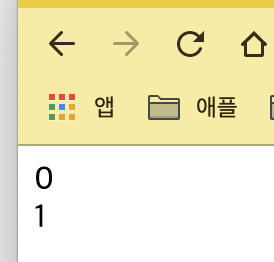
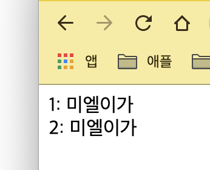
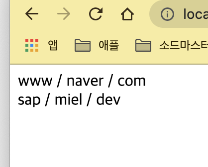

# 동기

- 다음 글의 번역 및 수정

  [Deep dive: How do React hooks really work? | Netlify](https://www.netlify.com/blog/2019/03/11/deep-dive-how-do-react-hooks-really-work/)

- useState, useEffect 편리하고 참 좋은데 어떻게 동작하지?
- Hooks는 사용자 인터페이스에서 상태 기반 동작과 부작용(Effect)을 캡슐화하는 간단한 방법을 제공합니다.
- React에서 처음 소개되었고, Vue, Svelte와 같은 다른 프레임워크에 의해 광범위하게 수용되었으며 심지어 일반 JS에도 적용되었습니다.
- 그러나 이것을 잘 이용하려면 Javascript Closure에 대한 좋은 이해가 필요합니다.
- 여기서는 React Hooks의 복제본을 구축합니다.

# 클로저란?

- JS의 기본 개념입니다.
- 함수가 스코프 밖에서 실행되는 경우에도 함수가 해당 스코프를 기억하고 액세스 할 수 있도록 하는 것입니다.
- 코드로 이해해 봅시다.

```jsx
// 예시 0
function useState(initialValue) {
  var _val = initialValue // useState에 의해 만들어진 _val은 지역변수입니다. (함수 종속)
  function state() {
    // state는 내부 함수입니다.
    return _val // state() 는 부모 함수에 정의된 _val 변수를 사용합니다.
  }
  function setState(newVal) {
    _val = newVal // _val을 노출하지 않고 수정만 합니다.
  }
  return [state, setState] // 외부로 state값과 setState함수를 노출시킵니다.
}
var [foo, setFoo] = useState(0) // 배열 비구조화 할당 사용
console.log(foo()) // 0을 찍습니다.
setFoo(1) // useState의 스코프 안에서 _val값을 수정합니다.
console.log(foo()) // 1을 찍습니다. 동일한 호출에도 불구하고 새로운 값을 얻습니다.
```

- 여기서 우리는 React의 useState 훅 클론을 만들어 봤습니다.
- useState 함수에는 2개의 내부 함수 state와 setState가 존재합니다. state는 지역 변수 \_val를 반환하고 setState는 \_val를 지역 변수로 전달된 매개변수(newVal)로 설정합니다.
- state를 얻어오려고 getter를 사용하는 것은 이상적이지 않습니다. 조금 후에 수정할게요 😊

# Functional Component에서의 사용

- 우리가 만든 useState를 익숙한 함수형 컴포넌트에 적용해 보겠습니다. Counter 컴포넌트를 만들어 보죠.

```jsx
// 예시 1
function Counter() {
  const [count, setCount] = useState(0) // 위에서 사용한 것 처럼 useState 사용
  return {
    click: () => setCount(count() + 1),
    render: () => `<div>${count()}</div>`,
  }
}
const C = Counter()
console.log(C.render()) // <div>0</div>
C.click()
console.log(C.render()) // <div>1</div>
```

- 여기서는 click 이벤트 핸들러를 연결하는 대신 프로그래밍 방식 API를 노출하였습니다 😓
- 또한 render가 stringify된 HTML TAG로 렌더링 하도록 하였습니다.
- 이러한 디자인을 통해 컴포넌트 렌더링을 시뮬레이션하고 사용자 액션에 반응해여 렌더링할 수 있습니다.

# Stale Closure

- 실제 React API와 일치시키려면 state가 함수가 아닌 변수여야 합니다. \_val 함수에 래핑하는 대신 단순히 노출하기만 하면 버그가 발생합니다!

```jsx
// 예시 0으로 돌아와서 - 버그가 있습니다!
function useState(initialValue) {
  var _val = initialValue
  // state 함수를 제거했습니다. 대신 return할 때 _val를 노출시킵니다.
  function setState(newVal) {
    _val = newVal
  }
  return [_val, setState] // _val을 직접 노출시킴
}
var [foo, setFoo] = useState(0)
console.log(foo) // 0이 출력될 것임
setFoo(1) // useState 스코프에 1을 설정함
console.log(foo) // 0을 출력함! - 원하는 동작이 아님 😓
```

- 이것은 Stale Closure 문제의 한 형태입니다.
- foo에 할당 할 때 구조 분해 할당을 사용하는데, 초기 useState 호출 시점의 \_val을 참고하지만 **다시는 변경되지 않습니다.** 이것은 우리가 원하는 것이 아닙니다.
- 우리는 일반적으로 현재 상태를 반영하는 컴포넌트의 상태가 필요하지만 함수 호출 대신 변수를 사용하길 원합니다.

# 모듈에서의 Closure

- 우리는 다음과 같이 유사 React 모듈을 정의하였습니다. - 모듈 패턴
- 여기서는 컴포넌트의 상태를 추적하지만 \_val하나만 추적하도록 단순화하였습니다.
- 이 디자인은 React 함수 컴포넌트를 "렌더링"할 수 있도록 하여 \_val이 매번 올바른 클로저로 내부 값 할당을 할 수 있도록 합니다.

```jsx
// 예시 2
const React = (function() {
  let _val // 모듈 스코프에 state를 잡아둡니다.
  return {
    render(Component, domElem) {
      const Comp = Component()
      const renderHTML = Comp.render() // 컴포넌트를 렌더링합니다.
      if (domElem) domElem.innerHTML = renderHTML // 브라우저에 직접 렌더링합니다.
      return Comp // 최신 컴포넌트 상태를 잡아둔 것을 반환합니다.
    },
    useState(initialValue) {
      _val = _val || initialValue // 매 실행마다 새로 할당됩니다.
      function setState(newVal) {
        _val = newVal
      }
      return [_val, setState]
    },
  }
})()
```

```jsx
// 예시 2 계속
function Counter() {
  const [count, setCount] = React.useState(0)
  return {
    click: () => setCount(count + 1),
    render: () => `<div>${count}</div>`,
  }
}
let App
App = React.render(Counter, document.getElementById("cnt1"))
App.click()
App = React.render(Counter, document.getElementById("cnt2"))
```

```html
<!DOCTYPE html>
<html lang="ko">
  <head>
    <meta charset="UTF-8" />
    <meta name="viewport" content="width=device-width, initial-scale=1.0" />
    <title>Document</title>
  </head>
  <body>
    <div id="cnt1"></div>
    <div id="cnt2"></div>
    <script src="./script.js"></script>
  </body>
</html>
```



- 이제 React Hooks와 비슷해 보이지 않으세요?

# useEffect 구현해보기

- 지금까지 기본적인 React Hook인 useState를 구현해 보았습니다. 다음으로 가장 중요한 Hook는 useEffect인데요, setState와 달리 useEffect는 비동기적으로 실행됩니다. 이것은 더 많은 클로저 문제를 내포할 수 있다는 것이죠.

```jsx
// 예시 3
const React = (function() {
  let _val, _deps // 스코프에 state와 dependencies를 잡아둔다.
  return {
    render(Component, domElem) {
      const Comp = Component()
      const renderHTML = Comp.render()
      if (domElem) domElem.innerHTML = renderHTML
      return Comp
    },
    useEffect(callback, depArray) {
      // dep가 없거나 dep가 바뀌었다면 콜백 실행
      const hasNoDeps = !depArray
      const hasChangedDeps = _deps
        ? !depArray.every((el, i) => el === _deps[i])
        : true
      if (hasNoDeps || hasChangedDeps) {
        callback()
        _deps = depArray
      }
    },
    useState(initialValue) {
      _val = _val || initialValue
      function setState(newVal) {
        _val = newVal
      }
      return [_val, setState]
    },
  }
})()

// 사용법
function Counter() {
  const [count, setCount] = React.useState(0)
  React.useEffect(() => {
    console.log("이펙트 발생: ", count)
  }, [count])
  return {
    click: () => setCount(count + 1),
    noop: () => setCount(count),
    render: () => `<div>${count}</div>`,
  }
}
let App
App = React.render(Counter, document.getElementById("cnt1")) // render: { count: 0 }
// 이펙트 발생: 0
// 렌더링 됨
App.click()
App = React.render(Counter, document.getElementById("cnt2"))
// 이펙트 발생: 1
// 렌더링 됨
App.noop()
App = React.render(Counter, document.getElementById("cnt1"))
// 아무런 이펙트가 실행되지 않음
// 렌더링은 그대로 1 (cnt1에 렌더링하였으므로 브라우저에 기존에 0이었던 값이 1이 됨)
App.click()
App = React.render(Counter, document.getElementById("cnt2"))
// 이펙트 발생: 2
// 렌더링 됨
```

- 의존성을 추적하기 위해 \_deps 변수를 새로 도입하였습니다.

# 마법이 아닙니다, 단지 배열입니다

- 우리는 useState와 useEffect을 구현해 봤습니다. 하지만 이 둘은 나쁘게도 싱글톤으로 구현되었네요 ! 이것들을 hooks 라는 이름의 array를 새로 도입하여 개선해 봅시다.

```jsx
// 예시 4
const React = (function() {
  let hooks = []
  let currentHook = 0 // hook의 배열, 반복자 !
  return {
    render(Component, domElem) {
      const Comp = Component()
      const renderHTML = Comp.render()
      if (domElem) domElem.innerHTML = renderHTML
      currentHook = 0 // 다음 렌더링을 위해 0으로 초기화
      return Comp
    },
    useEffect(callback, depArray) {
      const hasNoDeps = !depArray
      const deps = hooks[currentHook] // array 또는 undefined dlf rjtdlek.
      const hasChangedDeps = deps
        ? !depArray.every((el, i) => el === deps[i])
        : true
      if (hasNoDeps || hasChangedDeps) {
        callback()
        hooks[currentHook] = depArray
      }
      currentHook++ // 다음 훅을 위해서 증가시켜 준다.
    },
    useState(initialValue) {
      hooks[currentHook] = hooks[currentHook] || initialValue
      const setStateHookIndex = currentHook // setState(밑)의 클로저로 쓰려고 현재의 index를 여기에 따로 잡아둚
      const setState = newState => (hooks[setStateHookIndex] = newState)
      return [hooks[currentHook++], setState]
    },
  }
})()
```

- setStateHookIndex의 사용법을 주목하십시오. 아무것도 하지 않는 것처럼 보이지만 setState의 클로져 문제를 해결하는 데 사용되는 기법임에 유의하세요.

```jsx
// 예시 4 계속
function Counter() {
  const [count, setCount] = React.useState(0)
  const [text, setText] = React.useState("미엘이") // 두번째 훅 사용
  React.useEffect(() => {
    console.log("이펙트 발생: ", count, text)
  }, [count, text])
  return {
    click: () => setCount(count + 1),
    type: txt => setText(txt),
    noop: () => setCount(count),
    render: () => `<div>${count}: ${text}</div>`,
  }
}
let App
App = React.render(Counter, document.getElementById("cnt1")) // render: { count: 0 }
// 이펙트 발생: 0 미엘이
// 렌더링 됨
App.click()
App = React.render(Counter, document.getElementById("cnt2"))
// 이펙트 발생: 1 미엘이
// 렌더링 됨
App.type("미엘이가")
App = React.render(Counter)
// 이펙트 발생: 1 미엘이가
// 렌더링 됨
App.noop()
App = React.render(Counter, document.getElementById("cnt1"))
// 아무런 이펙트가 실행되지 않음
// 렌더링은 그대로 1 미엘이가 (cnt1에 렌더링하였으므로 브라우저에 기존에 0이었던 값이 1이 됨)
App.click()
App = React.render(Counter, document.getElementById("cnt2"))
// 이펙트 발생: 2 미엘이가
// 렌더링 됨
```



- 기본적인 직관은 각 hooks가 호출되고 컴포넌트가 렌더링 될 때 index가 재설정되고, hook이 불릴 때마다 증가한다는 것입니다.
- 심지어, 커스텀 훅도 만들 수 있다는 사실!

```jsx
// 예시 4 에서 다음 내용을 추가 및 수정

// useSplitURL 커스텀 훅을 만듦
function useSplitURL(str) {
  const [text, setText] = React.useState(str)
  const masked = text.split(".")
  return [masked, setText]
}
// Component 를 새로 만듦
function MyURLComponent() {
  const [text, setText] = useSplitURL("www.naver.com")
  return {
    type: txt => setText(txt),
    render: () =>
      `
      <div>
      ${text.reduce((x, y) => {
        return x + " / " + y
      })}
      </div>`,
  }
}

// 렌더링해봄
let App
App = React.render(MyURLComponent, document.getElementById("cnt1"))
App.type("sap.miel.dev")
App = React.render(MyURLComponent, document.getElementById("cnt2"))
```



- 이것은 "마법"이 아닌 "훅"이 얼마나 중요한 지에 기초합니다. 커스텀 훅은 프레임워크에서 제공하는 기본 요소에서 벗어나는 것입니다.
- React이든, 우리가 만든 작은 모듈이든 상관없습니다.

# Hook 규칙 도출

- 여기서 첫 번째 규칙인 [Only Call Hooks at the Top Level](https://reactjs.org/docs/hooks-rules.html#only-call-hooks-at-the-top-level)을 쉽게 이해할 수 있습니다.
  - 우리는 currentHook 변수를 사용하여 호출 순서에 대한 React의 의존성을 명시적으로 모델링하였습니다.
  - 우리의 구현을 염두에 두고 [규칙 설명 전체](https://reactjs.org/docs/hooks-rules.html#explanation) 를 읽고 진행되는 모든 것을 완전히 이해할 수 있습니다.
- 두 번째 규칙인 [Only Call Hooks from React Functions](https://reactjs.org/docs/hooks-rules.html#only-call-hooks-from-react-functions) 도 우리 구현의 필수 결과는 아니지만, 상태 저장 로직에 의존하는 코드 부분을 명시적으로 구분하는 것은 확실히 좋은 습관입니다.
