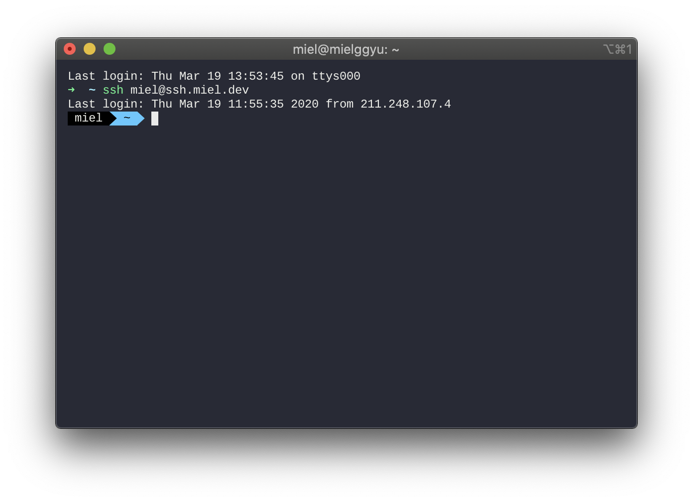

## 동기

`SSH(Secure Shell)` 는 원격 컴퓨터에 접속할 수 있게 하는 telnet 의 보안 프로토콜 버전입니다.

그런데, 이 ssh를 이용해서 github에 로그인할 수 있다는 사실! 알고 계셨나요?

SSH에 접속할 때는 아이디 / 비밀번호 외에 또 다른 방법으로 **public/private key pair 방식** (인증서)이 있습니다.

보안상 이점이 더욱 많다는 이유로 aws같은 곳에서는 기본적으로 아이디 / 비밀번호 방식의 로그인은 허용하지 않고 인증서만을 요구하게 됩니다.

그 이유는 인증 파일(비밀키)은 클라이언트에서만 보관하고 있고, 서버는 오직 퍼블릭 키로 해당 유저가 맞는지 체크하기 때문이랍니다.

간략하게 설명하자면, SSH에서는 대칭키 방식과 비대칭키 방식을 모두 사용하여 인증과 암호화를 하는데, 클라이언트 쪽에서 특정 '문장'을 자신의 개인키로 암호화해서 보내면, 서버에서는 공개키로 해당 '문장'을 해석하여 일치하게 되면 인증을 통과시켜 주는 원리입니다.

이 때부터는 사전에 공유된 비밀키로 대칭키 암호화 통신을 하게 됩니다.

## 진행

### 클라이언트 측

일단, 공개키와 개인키 역할을 할 파일을 만들어 줘야 한다.

```bash
$ ssh-keygen -t rsa
Generating public/private rsa key pair.
```

ssh 키를 저장할 위치를 지정한다. 기본값으로 두려면 그냥 엔터를 누른다.

```
Enter file in which to save the key (/home/miel/.ssh/id_rsa): <enter>
```

비밀번호를 생성하는 창이 뜬다. 비밀번호를 설정해도 좋고 안 해도 좋은데, 설정하지 않으면 비밀키 파일인 `id_rsa` 는 절대 노출되어선 안 된다.

```
Enter passphrase (empty for no passphrase): <Type the passphrase>

```

다음과 같이 출력되면 키가 성공적으로 만들어졌다는 뜻이다.

```
Your identification has been saved in /home/miel/.ssh/id_rsa.
Your public key has been saved in /home/miel/.ssh/id_rsa.pub.
The key fingerprint is:
xx:xx:xx:xx:xx:xx:xx:xx:xx:xx:xx:xx:xx:xx:xx:xx miel@mielggyu
```

홈 폴더/.ssh/ 로 이동하여 파일들을 본다.

```
$ ls -l ~/.ssh/
...
-rw-r--r--   1 miel  staff   446  3  9 21:10 config
-rw-------   1 miel  staff  1856  2 29 10:03 id_rsa
-rw-r--r--   1 miel  staff   422  2 29 10:03 id_rsa.pub
-rw-r--r--   1 miel  staff  2709  3 10 08:29 known_hosts
...
```

> `id_rsa` : 비밀키, 노출되면 안 되고 **권한설정을 600으로 해야 한다. (본인만 읽고 쓸 수 있어야 함)**

> `id_rsa.pub` : 공개키, 이것의 내용을 서버의 authorized_keys에 추가해야 한다.

이제 만들어진 공개키를 서버에 복사하자. scp 명령어를 사용한다.

```bash
$ scp $HOME/.ssh/id_rsa.pub <your_ssh_server_id>@<your_ssh_server.domain>:id_rsa.pub
```

### 서버 측

받은 id*rsa.pub 파일의 내용을 서버의 `authorized_keys`
파일에 추가 해 줘야 한다.

```bash
$ cat $HOME/id_rsa.pub >> $HOME/.ssh/authorized_keys
$ rm id_rsa.pub
```

### 클라이언트 측

서버에 접속을 시도해 보자.

```bash
$ ssh <your_ssh_server.domain>
```

비밀번호 없이 그냥 접속이 되면 성공이다.

